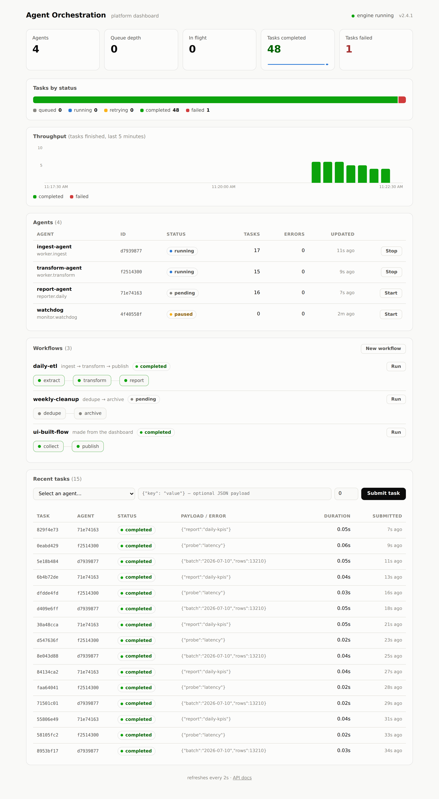
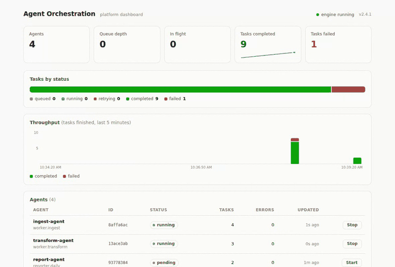

<!-- ARTEMIS-IGNIS-TOP:START -->
<p align="center">
  
</p>
<!-- ARTEMIS-IGNIS-TOP:END -->

<h1 align="center">Agent Orchestration Platform</h1>

<p align="center"><strong>Enterprise-grade AI agent orchestration framework</strong></p>

<p align="center">
  
  
  
</p>

<p align="center"><a href="README.ko.md">한국어</a></p>

A distributed platform for orchestrating autonomous AI agents in enterprise environments. Provides agent lifecycle management, inter-agent communication, task scheduling, and verifiable execution.

## Dashboard

The built-in dashboard is served at `/` — live agent status, throughput, workflows, task queue, and platform metrics, refreshed every 2 seconds. Agents can be started and stopped from the table, tasks can be submitted straight from the form, workflows can be created in a visual builder and run with one click showing per-step progress, and clicking any agent or task opens its full detail. Light and dark themes follow your system.

<picture>
  <source media="(prefers-color-scheme: dark)" srcset="docs/assets/dashboard-dark.png">
  
</picture>

<details>
<summary><strong>▶ Watch the live demo</strong> (tasks streaming in, agent controls, task detail modal)</summary>
<br>

</details>

## Architecture

```
┌──────────────────────────────────────────────────────┐
│             Agent Orchestration Platform             │
├────────────┬─────────────┬────────────┬──────────────┤
│  Agent     │  Task       │  Resource  │  Monitoring  │
│  Registry  │  Scheduler  │  Manager   │  & Alerting  │
├────────────┴─────────────┴────────────┴──────────────┤
│              Orchestration Engine (Core)             │
├──────────────────────────────────────────────────────┤
│            Plugin System & Extension API             │
├──────────────────────────────────────────────────────┤
│                     Python SDK                       │
└──────────────────────────────────────────────────────┘
```

## Key Features

- **Agent Lifecycle Management** — Register, deploy, scale, and retire agents
- **Intelligent Task Scheduling** — Priority-based scheduling with resource-aware allocation
- **Cross-Agent Communication** — Secure message passing with attestation
- **Enterprise Security** — RBAC, audit logging, secrets management
- **Observability** — Distributed tracing, metrics, and structured logging
- **Plugin Architecture** — Extensible via custom plugins and middleware

## Quick Start

```bash
# Clone and install dependencies (requires uv)
git clone https://github.com/Artemis-ignis/AgentOrchestration.git
cd AgentOrchestration
make install

# Run the test suite
make test

# Start the API server (http://127.0.0.1:8000)
uv run ao serve
```

### CLI

The `ao` command drives the platform end to end:

```bash
# Initialize a project (creates an example agent manifest)
uv run ao init my-agents

# Deploy the agent from its manifest
uv run ao deploy my-agents/agents/hello-agent.yaml

# View agent status (--watch refreshes every 2s)
uv run ao status

# Submit a task and wait for the result
uv run ao submit <agent-id> --payload '{"question": "hello"}'

# Inspect a single agent or task
uv run ao info <agent-id>
uv run ao task <task-id>
```

Point the CLI at a remote orchestrator with `--api-url` (or `$AO_API_URL`), and
authenticate with `--api-key` (or `$AO_API_KEY`). The server requires a Bearer
token only when started with `AO_API_KEY` set — with no key configured, auth is
disabled for local development.

### Persistence

State is in-memory by default. Point the server at a SQLite file to make
agents, task history, and workflows survive restarts — tasks that were still
queued or running when the server stopped are automatically re-enqueued:

```bash
uv run ao serve --db ao.db        # or: AO_DB_PATH=ao.db uv run ao serve
```

### REST API

Interactive docs are served at `/api/docs`. Core endpoints under `/api/v2`:

| Method   | Path                  | Description                          |
| -------- | --------------------- | ------------------------------------ |
| `POST`   | `/agents`             | Register an agent                    |
| `GET`    | `/agents`             | List agents (filter: status, group)  |
| `GET`    | `/agents/{id}`        | Agent details                        |
| `POST`   | `/agents/{id}/start`  | Start an agent                       |
| `POST`   | `/agents/{id}/stop`   | Stop an agent                        |
| `DELETE` | `/agents/{id}`        | Remove an agent                      |
| `POST`   | `/tasks`              | Submit a task to an agent            |
| `GET`    | `/tasks`              | Recent tasks (newest first)          |
| `GET`    | `/tasks/{id}`         | Task status and result               |
| `POST`   | `/workflows`          | Create a workflow of agent-task steps |
| `GET`    | `/workflows`          | List workflows with per-step status  |
| `POST`   | `/workflows/{id}/run` | Execute a workflow's steps in order  |
| `DELETE` | `/workflows/{id}`     | Remove a workflow                    |
| `GET`    | `/stats`              | Agent/task/queue aggregates          |
| `GET`    | `/metrics`            | Platform metrics snapshot            |

The dashboard itself is served at `/` (no auth required — data endpoints stay behind the API key when one is configured).

## Project Layout

| Path                | Description                                      |
| ------------------- | ------------------------------------------------ |
| `src/orchestrator/` | Core engine, workflow, and task scheduler        |
| `src/agent/`        | Agent registry, runtime, executor, and sandbox   |
| `src/api/`          | FastAPI server, routes, and middleware           |
| `src/sdk/`          | Python SDK for building agents                   |
| `src/cli/`          | `ao` command-line interface                      |
| `src/common/`       | Configuration, logging, metrics, and errors      |
| `tests/`            | Test suite                                       |

## Contributing

See [CONTRIBUTING.md](CONTRIBUTING.md) for contribution guidelines.

## Security

Please report vulnerabilities responsibly — see the [security policy](SECURITY.md).

## License

A license file has not been published yet. Until one is added, all rights are reserved by the repository owner.
